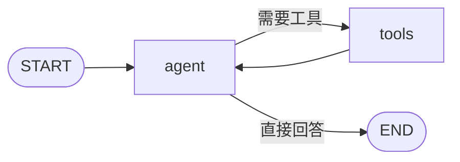

# 从零实现 AI Agent

用 DeepSeek 的对话接口，从「单次工具调用」逐步做到「多步推理 + 联网搜索」，再用 LangGraph 把循环画成状态图，最后在发邮件前暂停，等人确认后继续。前六个脚本各自独立，可以按顺序阅读和运行。`agent_core.py` 把这张图抽成可供导入的模块，`server.py` 用同一张图提供 HTTP 对话和审批。

模型通过 OpenAI 兼容接口调用 `deepseek-chat`。算术、时间和搜索由本地函数执行，模型只负责决定何时调用、以及如何根据返回结果组织答案。

## 学习路径

| 文件 | 能力 |
| --- | --- |
| `tool_demo.py` | 一个计算器。模型判断要不要调用，调用一次后生成最终回答。 |
| `multi_tool.py` | 计算器 + 当前时间。同一轮可以调用多个工具，结果汇总后再回答。 |
| `react_agent.py` | 多步循环。每轮观察工具结果，再决定继续调用还是给出答案，最多 6 步。 |
| `search_agent.py` | 在多步循环上增加 DuckDuckGo 搜索，用于新闻和实时信息。 |
| `langgraph_agent.py` | 用 LangGraph 表达同一套工具循环：`agent` 调模型，`tools` 执行函数，条件边决定继续还是结束。 |
| `hitl_agent.py` | 在同一张图上增加人工确认。`send_email` 执行前暂停，终端回复「确认」后才继续；同一次运行内用 `thread_id` 记住对话。 |
| `agent_core.py` | 供 `server.py` 导入的图。四个工具、状态和 `build_graph` 在这里。检查点由调用方传入。 |
| `database.py` | `app.db` 的异步引擎。启动时按模型建表。 |
| `models.py` | `conversations` 和 `messages` 两张表，用 `thread_id` 对应一条可展示的会话。 |
| `server.py` | FastAPI 服务。`POST /chat` 跑图，`POST /chat/resume` 提交审批，`GET /sessions/{thread_id}/messages` 按页读取已保存的消息。 |

## 环境

- Python 3.10+
- [DeepSeek API Key](https://platform.deepseek.com/)

```powershell
python -m venv .venv
.venv\Scripts\activate
pip install -r requirements.txt
copy .env.example .env
```

把 `.env` 里的 `DEEPSEEK_API_KEY` 换成自己的密钥。`.env` 已被 `.gitignore` 忽略，`.env.example` 只保留变量名。

`requirements.txt` 里的直接依赖：

| 包 | 用途 |
| --- | --- |
| `openai` | 前四个脚本直接请求 DeepSeek |
| `python-dotenv` | 从 `.env` 读取密钥 |
| `ddgs` | DuckDuckGo 搜索 |
| `langchain-openai` | `langgraph_agent.py`、`hitl_agent.py`、`agent_core.py` 里的 `ChatOpenAI` |
| `langgraph` | 状态图、`ToolNode`、`tools_condition`。`hitl_agent.py` 用内存检查点 `InMemorySaver` |
| `langgraph-checkpoint-sqlite` | `server.py` 把图状态写入 `checkpoints.db`，重启后还能继续未完成的审批 |
| `rich` | `hitl_agent.py` 用来打印模型回复 |
| `fastapi` | `server.py` 的 HTTP 接口和请求体校验 |
| `uvicorn` | 运行 `server:app` 的 ASGI 服务器 |
| `sqlalchemy` | `app.db` 里的会话和消息表 |
| `aiosqlite` | SQLAlchemy 异步访问 SQLite，也是 SQLite 检查点的依赖 |
| `greenlet` | SQLAlchemy 异步引擎需要它。缺少时导入 `sqlalchemy.ext.asyncio` 会失败 |

## 运行

```powershell
python tool_demo.py
python multi_tool.py
python react_agent.py
python search_agent.py
python langgraph_agent.py
python hitl_agent.py
python -m uvicorn server:app --reload
```

六个脚本启动后在终端输入问题，输入 `q` 退出。`server.py` 监听 `http://127.0.0.1:8000`，交互文档在 `http://127.0.0.1:8000/docs`。用 `python -m uvicorn` 可以走当前虚拟环境里的解释器。

可以试这些问法：

- `tool_demo.py`：`123 * 456 等于多少`
- `multi_tool.py`：`现在几点？再算一下 (10+5)/3`
- `react_agent.py`：`先告诉我现在的时间，再把小时数乘以 60`
- `search_agent.py`：`今天有什么科技新闻`
- `langgraph_agent.py`：`查一下今天的科技新闻，再把搜索结果条数乘以 2`
- `hitl_agent.py`：`帮我给 boss@example.com 发一封邮件，主题是周报，内容是本周工作已完成`
- `server.py`：先对 `/chat` 发同样的发信请求，拿到 `waiting_approval` 后再对 `/chat/resume` 提交「确认」

`react_agent.py` 和 `search_agent.py` 会在终端打印每一步调用的工具名、参数和观察结果。搜索结果较长，终端只显示前 200 个字符，完整内容仍会回传给模型。`langgraph_agent.py` 只打印最终回答。`hitl_agent.py` 在发信前打印确认问题，回复后再打印最终回答。

## 手写调用流程

前四个脚本自己维护 `messages`：

1. 把用户问题放进 `messages`，并附上工具说明书（函数名、说明、参数）。
2. 请求模型。若返回 `tool_calls`，按名称在 `available_tools` 里找到对应函数并执行。
3. 把执行结果以 `role: tool` 写回对话。
4. `tool_demo.py` 和 `multi_tool.py` 只再请求一次，让模型生成最终回答。
5. `react_agent.py` 和 `search_agent.py` 重复第 2、3 步，直到模型不再调用工具，或达到 `max_steps`（默认 6）。达到上限时返回「已达到最大步数，任务未完成。」

`search_agent.py` 另有一条系统提示，说明何时用搜索、计算和时间。

## LangGraph 里的同一条循环

`langgraph_agent.py` 不再手写 `for` 循环和 JSON 工具说明书。`@tool` 从函数签名和 docstring 生成说明书，`bind_tools` 把三个工具绑到模型上。

图里只有一份状态：不断追加的 `messages`。边的走向如下。



仓库里的 `graph_structure.png` 是同一张图。运行 `langgraph_agent.py` 时也会再导出一次；导出失败会被忽略，对话循环照常开始。

和手写循环的对应关系：

| 手写循环 | LangGraph |
| --- | --- |
| `for step in range(...)` | `tools` 执行完回到 `agent` |
| `if not msg.tool_calls` | `tools_condition` 走向结束 |
| 自己解析参数并调用函数 | `ToolNode` |

这张图没有 `max_steps`。LangGraph 默认递归上限是 25，超过后会抛错。进入图时只有用户消息，工具选择靠各函数的 docstring。

## 发信前的人工确认

`hitl_agent.py` 的图和 `langgraph_agent.py` 相同，多了三件事：

1. 编译时挂上 `InMemorySaver`。每次调用都带 `thread_id = "thread-1"`，同一轮进程里的对话会追加到这份状态上。进程退出后内存清空，重新运行不会接着上次的对话，停在半路的确认也不会保留。
2. 第一轮把系统提示和用户消息一起写入状态，要求发邮件时直接调用 `send_email`。之后只追加用户消息。
3. `send_email` 里调用 `interrupt()`。图停在工具节点，`settle()` 读取 `graph.get_state(config).interrupts`，把收件人、主题和正文打印出来。回复恰好是「确认」时，用 `Command(resume=...)` 从暂停处继续并返回「已发送」；其他内容返回「未发送」。这里没有真正的发信接口。

计算、查时间和搜索不会暂停。确认发生在工具函数内部，模型只要调用了 `send_email` 就会被拦住。

## 同一张图的 HTTP 接口

`agent_core.py` 把 `hitl_agent.py` 里的图抽出来：四个工具和 `agent` / `tools` 循环。它不自己创建检查点，只提供 `build_graph(checkpointer)`。`server.py` 启动时做两件事：`init_db()` 在 `app.db` 里建业务表，然后用 `AsyncSqliteSaver` 打开 `checkpoints.db` 并编译图。

这两个文件都是 SQLite 数据库，服务跑起来之后出现在项目目录里：

| 文件 | 内容 |
| --- | --- |
| `checkpoints.db` | 图的现场。完整消息、当前停在哪个节点、待审批的邮件。服务重启后，同一个 `thread_id` 还能接着跑。 |
| `app.db` | 给前端看的记录。`conversations` 用唯一的 `thread_id` 对应一条会话，`messages` 存 `user` 和 `assistant` 文本。 |

`POST /chat` 的地址是 `http://127.0.0.1:8000/chat`。请求体：

```json
{
  "thread_id": "thread-1",
  "message": "帮我给 boss@example.com 发一封邮件，主题是周报，内容是本周工作已完成"
}
```

`thread_id` 同时对应 `checkpoints.db` 里的一条图状态和 `app.db` 里的一条会话。同一个 id 会接上已有历史；换一个 id 就是新对话。

调用 `/chat` 时，如果这条线程还停在审批上，接口直接返回下面的 `waiting_approval`，不会把新消息写进图，也不会写进 `app.db`。如果检查点里有一次工具调用缺少工具结果，接口会先删掉从那条助手消息到末尾的记录，再继续这次请求。

否则先把用户消息写入 `app.db`，再 `ainvoke`。图跑完后再读一次状态。停在 `send_email` 的 `interrupt()` 时返回：

```json
{
  "status": "waiting_approval",
  "approval": {
    "question": "确认发送邮件给 boss@example.com？",
    "to": "boss@example.com",
    "subject": "周报",
    "body": "本周工作已完成"
  }
}
```

没有暂停时返回最后一条消息，例如问「现在几点？」：

```json
{
  "status": "completed",
  "reply": "现在是 2026-10-07 19:00:00。"
}
```

审批用 `POST http://127.0.0.1:8000/chat/resume`，`thread_id` 必须和暂停时的那次请求相同：

```json
{
  "thread_id": "thread-1",
  "decision": "确认"
}
```

`decision` 会回到 `interrupt()` 的返回值。内容恰好是「确认」时，`send_email` 返回已发送；其他文字返回未发送。计算、查时间和搜索在 `/chat` 里就会返回 `completed`，不会停下来等 `/chat/resume`。搜索超时或失败时，`web_search` 把原因写成文本交回模型，接口仍返回 `completed`。

只有状态是 `completed` 时，最后一条回复才会写入 `app.db` 的 `messages`，角色是 `assistant`。停在审批期间，库里只有用户那条，没有助手回复。

已保存的消息用 `GET http://127.0.0.1:8000/sessions/thread-1/messages?page=1&page_size=20` 读取。默认第 1 页、每页 20 条，按时间正序返回：

```json
{
  "thread_id": "thread-1",
  "page": 1,
  "page_size": 20,
  "total": 2,
  "items": [
    {"role": "user", "content": "现在几点？", "created_at": "2026-10-08 18:00:00"},
    {"role": "assistant", "content": "现在是 2026-10-08 18:00:00。", "created_at": "2026-10-08 18:00:01"}
  ]
}
```

PowerShell 里可以这样发起一轮普通对话：

```powershell
Invoke-RestMethod -Method Post -Uri http://127.0.0.1:8000/chat -ContentType "application/json" -Body '{"thread_id":"thread-1","message":"现在几点？"}'
```

CORS 允许任意来源，浏览器里的前端可以直接调用 `/chat`、`/chat/resume` 和 `/sessions/{thread_id}/messages`。服务没有根路径，打开 `http://127.0.0.1:8000/` 会返回 404。

## 工具

| 名称 | 作用 | 出现在 |
| --- | --- | --- |
| `calculator` | 计算数学表达式 | 全部脚本，以及 `agent_core.py` |
| `get_current_time` | 返回本地时间，格式 `YYYY-MM-DD HH:MM:SS` | `multi_tool.py` 及之后的脚本，以及 `agent_core.py` |
| `web_search` | 用 DuckDuckGo 搜索，取前 5 条标题和摘要。`agent_core.py` 里等待 20 秒，失败时返回「搜索失败」，不把异常抛出请求 | `search_agent.py`、`langgraph_agent.py`、`hitl_agent.py`、`agent_core.py` |
| `send_email` | 模拟发信。执行前暂停，只有回复「确认」才返回已发送 | `hitl_agent.py`、`agent_core.py` |

`calculator` 使用去掉内置函数的 `eval` 计算表达式，只适合本地演示，不要把它暴露给不受信任的输入。
